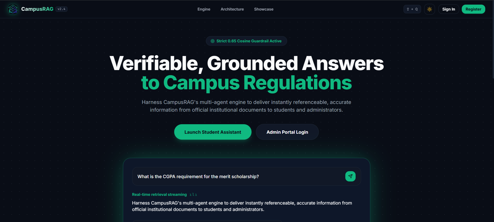

#  CampusRAG: Multi-Department Academic Assistant & Knowledge Engine



A production-grade, full-stack AI platform providing students and faculty with **verifiable, hallucination-resistant answers** ⚡ to campus queries across admissions, fee schedules, exam policies, academic calendars, hostel rules, and placement records using a multi-collection Retrieval-Augmented Generation (RAG) architecture 🚀.

---

## 🌐 Live Deployments

- **Frontend Application (Vercel):** [https://campusrag.vercel.app/](https://campusrag.vercel.app/)
- **Backend API & Telemetry (Render):** [https://campusrag-api.onrender.com/](https://campusrag-api.onrender.com/)

---

## 🚀 Key Highlights

- **Multi-Agent RAG Orchestration:**
  - **Router Agent:** Analyzes query intent and detects target department namespace (`admissions`, `academics`, `examinations`, `hostel`, `placements`).
  - **Retrieval Agent:** Fetches top-$k$ document chunks and filters out items below a strict similarity threshold ($0.65$).
  - **Grounding & Validation Agent:** Cross-checks generated answers against retrieved context snippets. If context is missing or irrelevant, halts creative generation and emits a verified campus office referral.
  - **Citation Agent:** Generates interactive source badges with document title, page number, similarity match %, and exact context snippets.
- **Document Ingestion Engine:** Admins upload campus PDFs $\rightarrow$ Multer buffers file $\rightarrow$ `pdf-parse` extracts raw text $\rightarrow$ LangChain `RecursiveCharacterTextSplitter` chunks content $\rightarrow$ Google `gemini-embedding-001` (Stable) / `gemini-embedding-2-preview` (Multimodal) generates dense vectors $\rightarrow$ Indexed into Pinecone Serverless / In-Memory Cosine Similarity Vector Store.
- **Real-Time Token Streaming:** Server-Sent Events (SSE) stream responses live with cursor typography, mathematical KaTeX formula rendering, and formatted tables.
- **Global Keyboard Shortcuts & Micro-Animations:**
  - `Shift + Q` hotkey active globally to launch and auto-focus a new academic query from any page.
  - Hardware-accelerated 60fps view transitions and instantaneous GPU glide smooth scrolling.
- **Role-Based Access Control (RBAC):**
  - **Student Role:** Ask questions, switch department filters, view interactive citation popovers, rate answers (thumbs up/down), manage thread history.
  - **Admin Role:** Ingest new campus PDFs with real-time multi-stage telemetry (`UPLOADING` $\rightarrow$ `CHUNKING` $\rightarrow$ `EMBEDDING` $\rightarrow$ `INDEXED`), delete outdated notices, view query analytics & identify knowledge gaps.
- **Zero-Dependency Dual Fallback:** Runs seamlessly out of the box with automated in-memory vector similarity calculations and local MongoDB fallback if credentials are not configured.

---

## 🛠️ Tech Stack

### Frontend
- **Framework:** Next.js 15+ (Pages Router), React 19
- **Styling:** Tailwind CSS, PostCSS, Lucide Icons, Glassmorphism, 60fps Dark/Light Mode
- **State Management:** Zustand 5 with persistent session storage
- **Math & Markdown:** React Markdown, remark-gfm, remark-math, KaTeX
- **Networking:** Axios, Server-Sent Events (SSE) fetch stream

### Backend
- **Runtime:** Node.js 20 LTS / Node.js 22 LTS, Express 4.21+ / Express 5
- **Database:** MongoDB Atlas / Mongoose 8 (with In-Memory Fallback)
- **Vector Database:** `@pinecone-database/pinecone` ^4.0 (with In-Memory Cosine Similarity Store)
- **AI Integration:** Google Generative AI SDK (`gemini-3.7-flash` [Stable], `gemini-2.5-flash` [Stable], `gemini-embedding-001` [Stable], `gemini-embedding-2-preview` [Multimodal]), OpenRouter API fallback, Grounded Local Synthesizer
- **Document Processing:** LangChain (`@langchain/textsplitters`), `pdf-parse`, Multer
- **Security:** JWT Authentication, bcryptjs (Cost 12), Helmet, Express Rate Limiter, CORS, express-validator

---

## 📂 Project Structure

```text
├── client/                     # Next.js Pages Router Frontend
│   ├── public/                 # Static Assets (favicon.ico, logo.png)
│   ├── src/
│   │   ├── components/
│   │   │   ├── Analytics/      # StatCards, Query Volume Bars, Unresolved Gaps
│   │   │   ├── AppShell/       # ActivityRail, AppShell, Navbar, Sidebar
│   │   │   ├── Chat/           # ChatInput, ChatMessage, CitationBadge, CitationDrawer, DepartmentSelector
│   │   │   ├── DocumentManager/# DocumentListTable, DocumentUploadModal
│   │   │   └── ProtectedRoute/ # RBAC Route Guard
│   │   ├── pages/
│   │   │   ├── _app.js         # Global Styles, KaTeX, SEO, Global Shift+Q Hotkey
│   │   │   ├── _document.js    # Document Structure & Meta
│   │   │   ├── index.js        # Landing Page & Department Showcase
│   │   │   ├── login.js        # Auth with 1-Click Demo Logins
│   │   │   ├── register.js     # Student & Faculty Registration
│   │   │   ├── settings.js     # User Profile, Keyboard Cheatsheet, System Health
│   │   │   ├── admin/
│   │   │   │   ├── dashboard.js# Admin Analytics & Telemetry Console
│   │   │   │   └── documents.js# Document Knowledge Base Management
│   │   │   └── chat/
│   │   │       ├── index.js    # 2x3 Bento Academic Search & Exploration
│   │   │       └── [threadId].js# Conversational Multi-Agent Assistant
│   │   ├── services/           # Axios API Client & SSE Streaming Fetch
│   │   ├── store/              # Zustand authStore & chatStore
│   │   ├── styles/             # globals.css (Micro-Dot Grid, Themes, KaTeX)
│   │   └── utils/              # glideScroll.js, themeTransition.js
│   ├── package.json
│   ├── postcss.config.js
│   └── tailwind.config.js
│
├── server/                     # Express & Multi-Agent Backend
│   ├── src/
│   │   ├── agents/             # routerAgent.js, retrievalAgent.js, validationAgent.js, citationAgent.js
│   │   ├── config/             # db.js, env.js, vectorDb.js
│   │   ├── controllers/        # adminController.js, authController.js, chatController.js
│   │   ├── middlewares/        # authMiddleware.js, errorHandler.js, roleMiddleware.js, uploadMiddleware.js
│   │   ├── models/             # User.js, Document.js, DocumentChunk.js, ChatThread.js, ChatMessage.js, QueryAnalytics.js
│   │   ├── routes/             # adminRoutes.js, authRoutes.js, chatRoutes.js
│   │   ├── scripts/            # seed.js, verify-e2e.js
│   │   ├── services/           # authService.js, documentService.js, embeddingService.js, ragService.js, vectorService.js
│   │   └── server.js           # Server Initialization, Rate Limiting, Health Checks
│   ├── .env.example
│   └── package.json
│
├── public/                     # Brand Assets (cover.png, logo.png)
├── spec.md                     # Complete Technical Specification
└── README.md                   # Setup, Architecture & Documentation
```

---

## ⚡ Step-by-Step Setup Guide

### Prerequisites
- **Node.js**: v20.0.0 LTS or v22.0.0 LTS
- **npm**: v10.0.0 or later

---

### Step 1: Install Dependencies

1. **Install Backend Dependencies:**
   ```bash
   cd server
   npm install
   ```

2. **Install Frontend Dependencies:**
   ```bash
   cd ../client
   npm install
   ```

---

### Step 2: Configure Environment Variables

1. In the `server` directory, create a `.env` file (or copy `.env.example`):
   ```bash
   cd ../server
   cp .env.example .env
   ```

2. **Configuration Settings (`server/.env`):**
   ```ini
   PORT=5000
   NODE_ENV=development
   CLIENT_URL=http://localhost:3000
   
   JWT_SECRET=campusrag_super_secret_jwt_key_2026_nxtwave
   JWT_EXPIRES_IN=7d
   
   # MongoDB Atlas Connection (Runs in-memory fallback automatically if offline)
   MONGODB_URI=mongodb+srv://<username>:<password>@cluster.mongodb.net/campusRAG?retryWrites=true&w=majority
   
   # Google Gemini API Key (Gemini 3.7 / 2.5 Series)
   GEMINI_API_KEY=your_gemini_api_key_here
   
   # Pinecone Serverless Vector Database (Runs dual in-memory fallback if empty)
   PINECONE_API_KEY=your_pinecone_key_here
   PINECONE_INDEX=quickstart
   PINECONE_ENVIRONMENT=us-east-1
   ```

---

### Step 3: Run the Application Locally

1. **Start the Backend Server:**
   ```bash
   cd server
   npm run dev
   ```
   *The server runs on `http://localhost:5000` and automatically seeds demo accounts and 5 pre-indexed campus handbooks.*

2. **Start the Next.js Frontend:**
   ```bash
   cd ../client
   npm run dev
   ```
   *Open [http://localhost:3000](http://localhost:3000) in your browser.*

---

## 🔑 Demo Accounts & Quick Login

The login page provides instant **1-Click Demo Login** buttons ⚡:

| Role | Email | Password | Permissions |
|---|---|---|---|
| **Student** | `student@campus.edu` | `Student@123` | Conversational Assistant, 2x3 Bento Search, Department Selector, Citations, Feedback, Thread History |
| **Department Admin** | `admin@campus.edu` | `Admin@123` | All Student privileges + Upload PDFs, Chunk Inspector, Re-indexing, Admin Analytics, Knowledge Gap Audit |

---

## 📚 Pre-Indexed Campus Knowledge Handbooks

The platform comes pre-loaded with official campus policies across all domains 🏛️:

1. **Admissions & Fee Regulations 2026-2027 (admissions):**
   - 60% PCM eligibility cutoff, annual tuition fee of Rs. 1,45,000 (payable in 2 equal installments).
   - Dean's Merit Scholarship (50% tuition waiver), Institutional Need-Based Aid (75% tuition assistance).
   - 100% refund policy if formally withdrawn 15 days prior to orientation.
2. **Academic Regulations & Course Credit System (academics):**
   - Minimum 75% attendance rule (65%-74% medical condonation with Rs. 1,500 fee per subject).
   - 160 total graduation credits, 20-24 normal credits/semester, 28-credit overload for CGPA $\ge 8.5$.
   - 10-day elective course drop/change window via ERP portal.
3. **Examination Rules, Grading Scheme & Revaluation Manual (examinations):**
   - 10-point scale: 'O' (10, $\ge 90\%$), 'A+' (9), 'A' (8), 'B+' (7), 'B' (6), 'C' (5), 'F' (0).
   - CGPA calculation formula: $\text{CGPA} = \frac{\sum (\text{Credits} \times \text{Grade Points})}{\sum \text{Credits}}$.
   - Arrear exam fees (Rs. 800 theory, Rs. 1,000 lab). Answer script photocopy (7 days) & Revaluation (14 days, Rs. 1,200).
4. **Hostel Code of Conduct & Residential Regulations (hostel):**
   - Curfew timings: 9:30 PM (weekdays), 10:00 PM (weekends).
   - Parent OTP electronic leave pass system (24 hours advance request).
   - Mess fee Rs. 24,000/semester, Rs. 100/day mess rebate for $>5$ days authorized absence.
5. **Placement Guidelines, Internship Policy & Code of Conduct (placements):**
   - 6.50 minimum CGPA eligibility, zero active backlogs.
   - One-student-one-offer policy with Dream Offer exception ($2.0\times$ initial CTC or $\ge$ 15 LPA).
   - 8th-semester full-time 6-month industry capstone conversion.

---

## 📡 API Endpoints Reference

### Authentication & Users
- `POST /api/auth/register` — Register a student or faculty account
- `POST /api/auth/login` — Authenticate credentials and receive JWT bearer token
- `GET /api/auth/me` — Fetch active session user profile and role authority
- `GET /api/health` — Heartbeat check reporting MongoDB, Vector DB, and Gemini AI status

### Chat & RAG Engine
- `GET /api/chat/threads` — List user's conversation threads sorted by activity
- `POST /api/chat/threads` — Create a new academic query thread
- `GET /api/chat/threads/:threadId` — Load messages, citations, and metadata for a thread
- `POST /api/chat/threads/:threadId/message` — Send query, execute multi-agent RAG pipeline, stream SSE tokens
- `POST /api/chat/messages/:messageId/feedback` — Submit thumbs up/down rating and evaluation notes
- `DELETE /api/chat/threads/:threadId` — Delete conversation thread and history

### Admin Document Management & Telemetry
- `GET /api/admin/documents` — List indexed PDF handbooks with chunk counts and statuses
- `POST /api/admin/documents/upload` — Upload PDF, chunk via LangChain, generate vector embeddings, and index
- `DELETE /api/admin/documents/:id` — Delete document, chunk records, and vector embeddings
- `GET /api/admin/analytics` — Query volume, grounding rates, latency, and unresolved knowledge gaps

---

## 🧪 Verification & Testing

1. **Verify Backend Health:**
   ```bash
   curl http://localhost:5000/api/health
   ```
2. **Verify Seeding & Knowledge Ingestion:**
   ```bash
   cd server
   node src/scripts/seed.js
   ```
3. **Build Frontend for Production:**
   ```bash
   cd client
   npm run build
   ```

---

## 📜 License & Credits

Built with precision for the **CampusRAG: Multi-Department Academic Assistant & Knowledge Engine** platform ✨.
